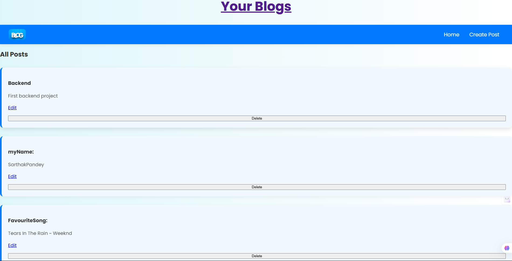
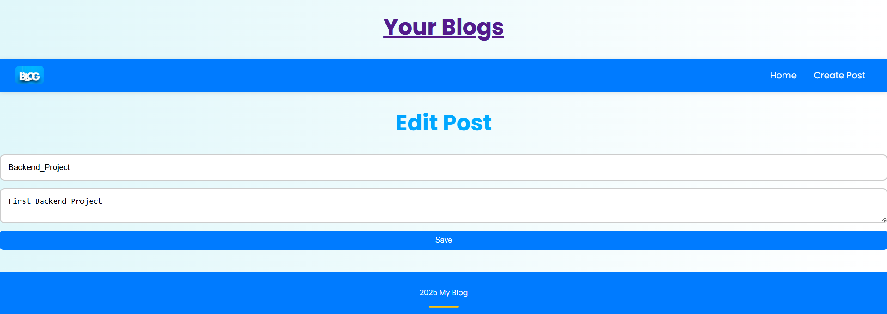

# 📝 Blog Web Application

This is a simple and elegant **Blog Web Application** built with **Node.js**, **Express.js**, and **EJS**. The app allows users to create, edit, view, and delete blog posts — all stored in-memory (no database). It is styled with modern CSS including animations, hover effects, and responsiveness for both desktop and mobile views.

---

## 🔧 Technology Stack

| Layer        | Technology     |
|--------------|----------------|
| Runtime      | Node.js        |
| Framework    | Express.js     |
| Templating   | EJS            |
| Styling      | CSS3 (Flexbox, Transitions, Animations) |
| Hosting Port | `http://localhost:3000` |

---

## 📁 Project Structure

- blog-app/
- │
- ├── public/
- │ ├── styles/
- │ │ └── styles.css # Main CSS styling file
- │ └── images/
- │ ├── logo.png # Logo for the site
- │ └── bg.jpg # Background image
- │
- ├── views/
- │ ├── index.ejs # Home page (view all posts)
- │ ├── create.ejs # Create new post form
- │ └── edit.ejs # Edit existing post form
- │
- ├── routes/
- │ └── index.js # All routing logic
- │
- ├── app.js # Main application file (entry point)
- ├── package.json # Project metadata and dependencies
- └── README.md # This file

---

## ✨ Features

- ✅ **Post Creation** – Add new blog posts with title and content
- ✅ **Post Viewing** – View all posts on the homepage
- ✅ **Post Editing** – Edit existing posts through an intuitive form
- ✅ **Post Deletion** – Remove posts with a single click
- ✅ **Modern Styling** – Clean UI with cool hover effects and animations
- ✅ **Responsive Design** – Works beautifully on both mobile and desktop
- ✅ **No Database Needed** – Posts are stored in memory (not persisted)

---

## 🚀 How to Run Locally

### 1. Clone the repository

``bash
git clone https://github.com/your-username/blog-app.git
cd blog-app``

### 2.  Install dependencies

``bash
npm install``

### 3.Start the server

``bash
node app.js``

### 4.Open the browser
 - Go to: http://localhost:3000

## 📸 Screenshots

### 🏠 Home Page
View of the homepage displaying all blog posts.

---

### 📝 Create Post
Form used to create a new blog post.

---

### ✏️ Edit Post
Edit interface for modifying an existing blog post.

